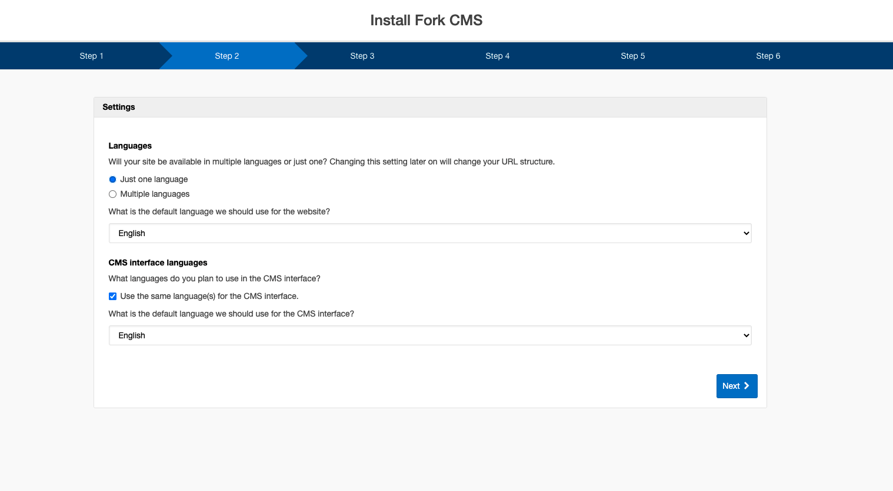

# Installation

## Step 1: Download

PHP Developers using Composer can use this command to install the latest stable release of Fork from the command line:

    composer create-project forkcms/forkcms .

Alternatively, you can install Fork CMS by downloading it from the website.
Before downloading, check if your server meets the [minimum requirements](docs/03. minimum_requirements.md) for
Fork CMS. If it does, create a MySQL database and remember the credentials. Next,
[download](http://www.fork-cms.com/download) the latest release and
[unpack](http://en.wikipedia.org/wiki/Tar_%28file_format%29) the folder.

## Step 2: Upload

Use an FTP Program like [Transmit](http://www.panic.com/transmit/) (Mac) or [Smart FTP](http://www.smartftp.com/)
(PC) to upload the contents of the folder to the root of the server that will host your website.

Upload the unpacked files into the document_root of your webserver. Make sure you've also copied the
**.htaccess** file, as it may be hidden on certain fileservers.

## Step 3: Installation

Use your browser to surf to your domain (this should forward you to the Fork CMS installer).
[Follow the steps](docs/02. installation_wizard.md) and you're done!

> Don't panic if you experience problems during the installation. Start by taking a look at our
[Frequently Asked Questions](docs/07. faq.md).
