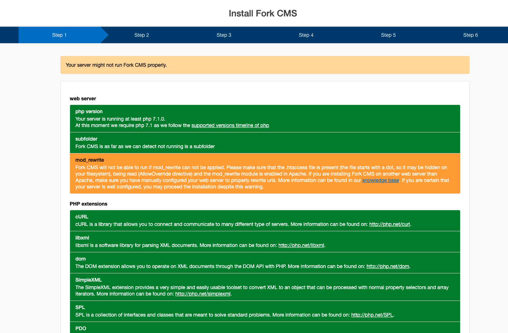
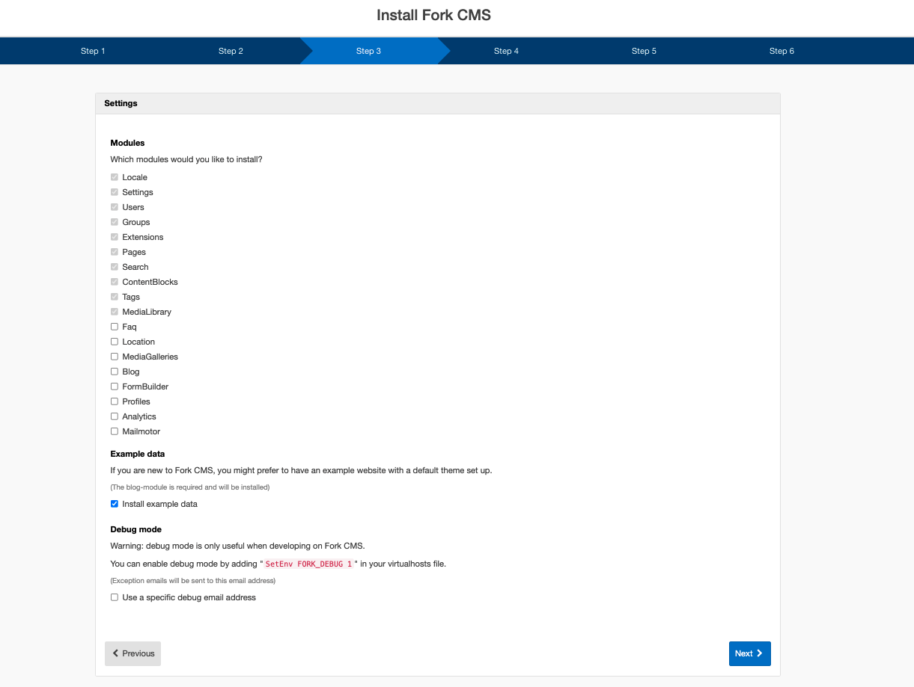
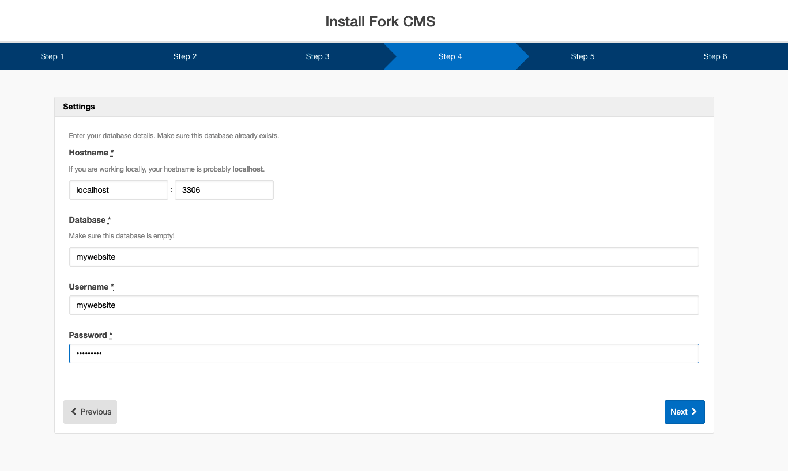
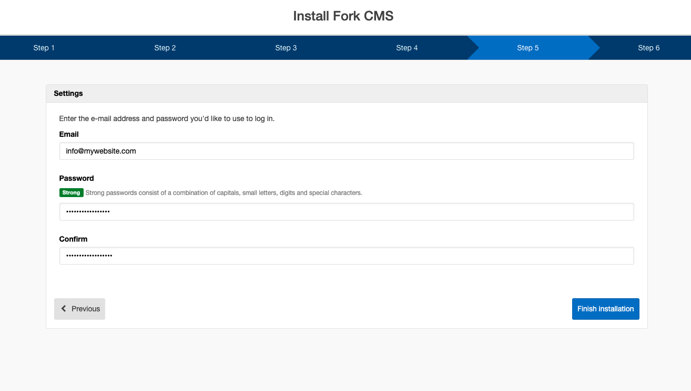
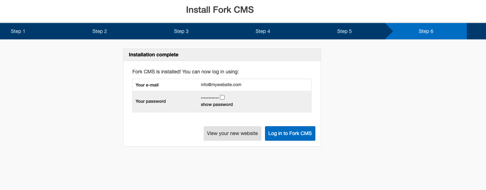

# Installation Wizard

## Step 1: Check library

First the library is checked to verify it is in the correct location and is accessible. If no errors are found, this step will not be displayed.

## Step 2: Check requirements

Before we start the installation we want to make sure everything is configured properly. The wizard goes through all [Minimum Requirements](docs/03. minimum_requirements.md), including PHP Version, subfolder restriction, PHP Extensions, PHP ini-settings, PHP functions, and webserver configuration.

At last, the filesystem is checked. Some directories need write privileges in order to create cache files or to upload assets. You can use your FTP client -- or `chmod` on systems where you have ssh access -- to set the proper rights.

## Step 3: Languages

One of the most remarkable features of Fork CMS is the built-in multilingual support. In step 3 the languages are chosen for both the front and back end. The default language you select in this step is shown if the *locale* module can't determine the browser's language.

## Step 4: Modules & Debug mode

It is recommended that you only install modules that are necessary for the initial deployment of your website; after installation it is only a click to install additional modules. You may wish to enable the debug mode to prevent caching while developing the website.

## Step 5: Database

Enter your MySQL credentials.

## Step 6: God

The user you create here has "god status" (and will have an avatar of Chuck Norris by default!), which means he has all rights. Make sure you specify a strong password for this almighty power.

## Step 7: Finishing

Finally, all necessary files are created in the background and your success message is displayed.

If the installation is finished you can [start configuring](../02. getting started/01. introduction.md) your website and tools.
