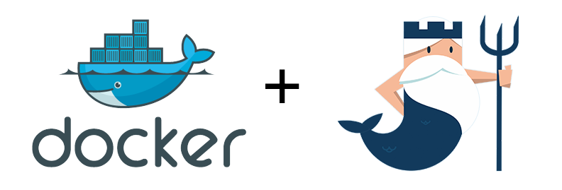
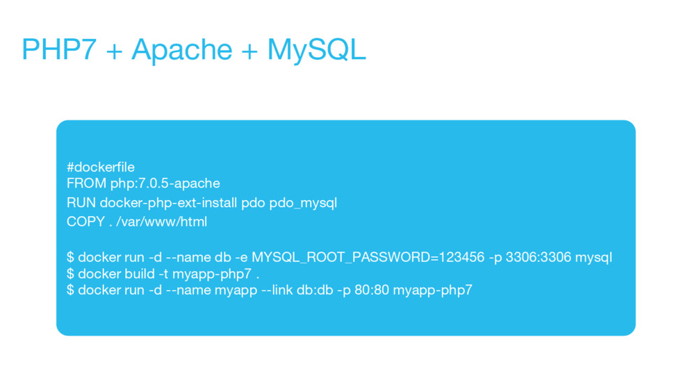
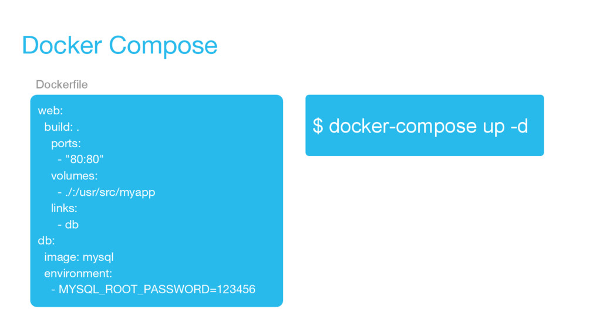
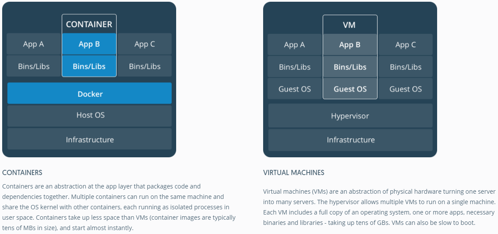
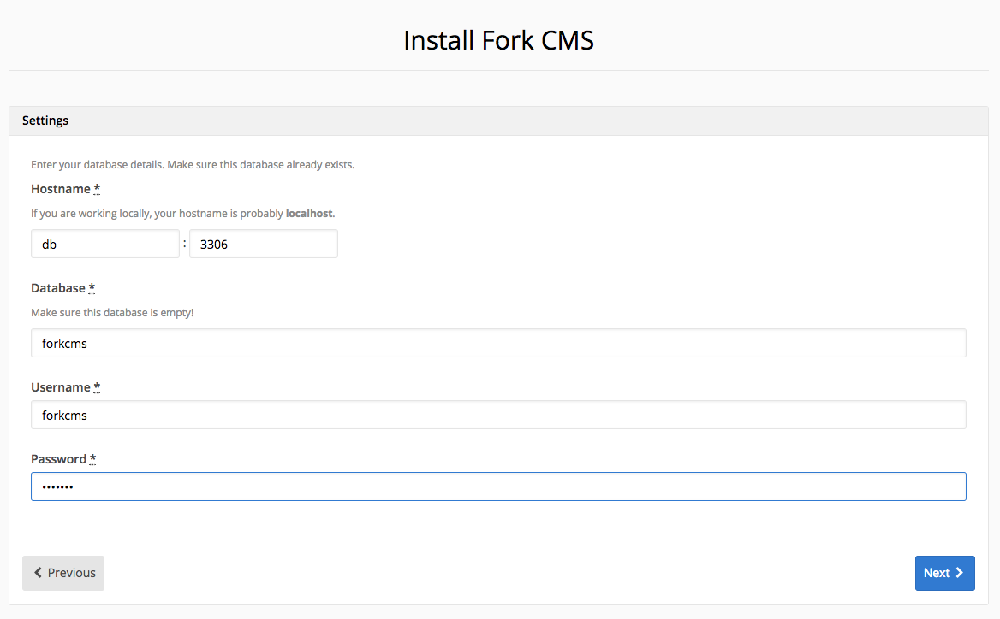
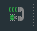
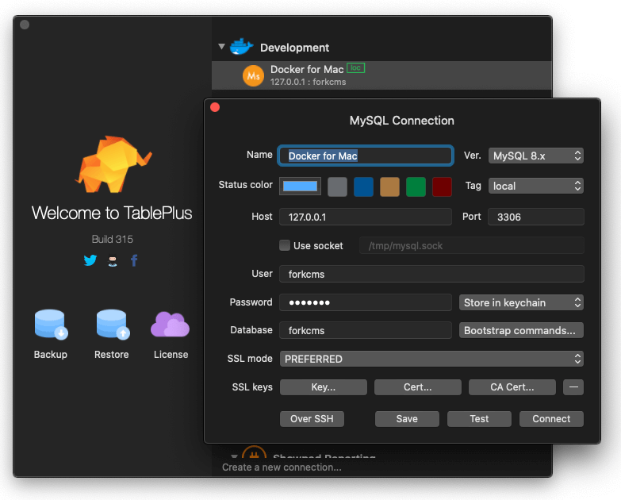

# Local development using Docker

## Overview
Fork CMS comes with a Docker PHP development environment that facilitates running your website in a containerized environment.



Included is a `docker-compose`-powered stack to get your Fork CMS PHP project up and running in no time, without the hassle of 
installing and configuring PHP yourself locally, like in a Vagrant box or in MAMP/WAMP. 
By default the containerized development environment comes with:
* [PHP 7.4](https://store.docker.com/images/php) (with extensions GD2, pdo, zip, intl, ... and XDebug)
* Apache
* [MariaDB](https://store.docker.com/images/mariadb) (latest)

**Features:**
* Easy to set and start up a project (`docker-compose up`).
* Easily disposable stack (`docker-compose down --volumes`).
* Easily switch between PHP versions: 7.4, 8.0, ... by editing the Dockerfile to fit your needs.
* Easy to customize, e.g. add PHP extensions, with a simple edit to the `Dockerfile`.
* Clean and well structured Dockerfile
* Simple configuration (single .env file)
* All containers extend from an official, trusted base image.
* Everything is visible and editable to fit your needs of the project.
* Docker runtime independent (run it on Docker for Mac, VM, AWS...)
* Any team member can quickly boot up your project because the Dockerfile and docker-compose files are added to your version control.
* Easily add new containers to `docker-compose.yml` to fit your project needs (only a few lines to add Redis, MongoDB, RabbitMQ...)

## Table of Contents
* [What is Docker?](#what-is-docker)
  * [Benefits over Vagrant and local webservers](#benefits-over-vagrant-and-local-webservers)
* [Running ForkCMS on Docker](#running-forkcms-on-docker)
  * [Installing Docker on Mac/Windows](#installing-docker-on-macwindows)
  * [Run your local Fork CMS website using Docker](#run-your-local-fork-cms-website-using-docker)
* [PHPStorm configuration](#phpstorm-configuration)
  * [General setup + XDebug](#general-setup-and-xdebug)
  * [Running tests in PHPStorm with Docker and PHPUnit](#running-tests-in-phpstorm-with-docker-and-phpunit)
* [Docker cheatsheet](#docker-cheatsheet)
* [FAQ](#faq)


## What is Docker?
Docker is a platform that allows us to develop, ship and run applications. With Docker, you can manage 
your infrastructure in the same ways you manage your application. 

> Docker containers wrap up a piece of software in a complete filesystem that contains everything it needs to run: 
> code, runtime, system tools, system libraries – anything you can install on a server. This guarantees that it 
> will always run the same, regardless of the environment it is running in.

Docker has 3 important advantages:

1. Consistency. Everything that is needed for the application to run, gets packaged into 1 or more containers.
2. Ease of implementing new technology. Ever wanted to try out a new database (Redis, Elasticsearch, ...)? Adding it
to your stack is easy with Docker.
3. Cross-platform.

The most important files in our containerized environment are `Dockerfile` and `docker-compose.yml`. You can find both
in the Fork CMS root directory. 

A very basic example of a `Dockerfile` and `docker-compose.yml`:

 

* The Fork CMS `Dockerfile`, found in the root, describes that we start from a "base image" (php+apache), typically found on the 
[Docker Store](https://store.docker.com/). We add our project-specific configuration to this base image: additional
php extensions, custom php.ini settings, Xdebug, installation of the composer dependencies, ... This Dockerfile will be used
to build a Docker "image" which is used to boot up the container. 
* Our `docker-compose.yml` file, found in the root, describes how our services work together. We only have 2 services: the app and the db service. In the `docker-compose.yml` file, we specify that the app-service is linked and can communicate with the
database, which ports we expose to our host machine, which environment variables are set inside the container, and 
which volumes get mounted from our host computer to the container.

#### Benefits over Vagrant and local webservers
So why use Docker and not Vagrant? **While Vagrant creates a virtual machine in minutes, Docker creates virtual 
"containers" in seconds.** Instead of providing a full VM like Vagrant does, **Docker provides you with lightweight 
containers** that share the same kernel and allow you to safely execute independent processes. This means that Docker uses
**only** what it needs to run your application — nothing more. In addition to speed, Docker gives you a lot of features 
that cannot be achieved with Vagrant. The most important fact about Docker is that it can be used for development and 
on production, ensuring a consistent environment everywhere that bundles with the code you write. 
Vagrant is designed for development only, so a production server still needs to be provisioned every time.

Take a quick look at the differences between lightweight Docker containers and virtual machines:


While you can run and develop Fork CMS websites on a local webserver ([WAMP](http://www.wampserver.com/en/), 
[MAMP Pro even has Fork CMS integration](https://documentation.mamp.info/en/MAMP-PRO-Mac/Settings/Hosts/Extras/ForkCMS/)),
these local webservers are usually good as a "one size fits all" solution. If you occasionally create a website, using
shared hosting, then WAMP/MAMP probably fits your needs. Nevertheless, Docker is definitely worth looking into!


## Running ForkCMS on Docker
### Installing Docker on Mac/Windows
The easiest way to run Docker containers on your computer is by installing [Docker for Mac](https://www.docker.com/docker-mac).
For Windows-based systems, you can download [Docker for Windows](https://www.docker.com/docker-windows). If you're a
Linux user, you're lucky because Docker is meant to run on Linux. Find the installation for your Linux distro on 
[docker.com](https://www.docker.com). E.g. [Docker for Ubuntu](https://www.docker.com/docker-ubuntu).

After installing, you can run Docker. Make sure to visit the preferences and assign it a decent amount of CPU's and 
memory (at least a few GB"s). While Docker is running, you can use commands such as `docker` and `docker-compose` in the terminal.

### Run your local Fork CMS website using Docker
*If this is an existing project, remove your `app/config/parameters.yml`. This ensures that we can install a 
fresh copy and it won't try to look for an existing database. You can import a database backup later.*

**Let's see how easy it is to get Fork CMS up and running on PHP7, Apache and MariaDB.**

- Clone Fork CMS
```
git clone git@github.com:forkcms/forkcms.git
```

- Spin up the Docker containers: 
```
docker-compose up -d
```
*This command will look at the `docker-compose.yml` file and spin up a container for every service we defined (app and db). 
Wait for the containers to boot. The first time this can be slow because it needs to build the `Dockerfile` container image. 
Once that's done, starting and stopping the containers will be very fast. We start the containers with the option `-d` 
to make sure they start in "detached" mode, which basically means that they'll run in the background and our website won't stop running when we quit
the terminal.*
 
- Check if the containers are up and running now:
```
docker-compose ps

Name            Command                         State    Ports
-------------------------------------------------------------------------------------------------------
forkcms_app_1   docker-php-entrypoint apac ...   Up      0.0.0.0:443->443/tcp, 0.0.0.0:80->80/tcp
forkcms_db_1    docker-entrypoint.sh mysqld      Up      0.0.0.0:3306->3306/tcp
```
You should see something similar appear: two containers are up and running. One container for the webserver with php and one
for the database. Port 80, 443 and 3306 are exposed to our host machine. If one of the containers is down, you can
inspect the logs by running: `docker-compose logs -f app` or `docker-compose logs -f db`. 

- Go to [http://localhost](http://localhost) and you should see the Fork CMS installer appear. 
- Follow the steps of the installer
- Use the following credentials when the installer asks you for database settings:
    - Hostname: `db` (the name of the database Docker service. As PHP runs inside a docker container, we cannot use localhost or 127.0.0.1 here).
    - Port: `3306`
    - Username: `forkcms`
    - Password: `forkcms`
    - Database: `forkcms`
    
    
    
You can easily use different credentials by adjusting them in the `docker-compose.yml` file, but these are the default.
 
- Finish the installation process. That's it, enjoy your fresh local Fork CMS installation powered by Docker. 
Go to `http://localhost` to see Fork CMS.


## PHPStorm configuration

### General setup and XDebug
[Video - watch how to setup PHPStorm and Xdebug](https://d.pr/v/6OXvva)

It's easy to set up PHPStorm in combination with Docker and Xdebug, one of the most popular tools to debug your PHP application. 
In the `var/docker` folder you will find a `.env` file containing some defaults for Docker.

- You can edit the `.env` file to add or change in some information for your system and configure XDebug. By default, it contains a special
hostname available for Docker for Mac users, but you can change it to point to your own Docker host IP.
- Recreate your Docker containers, because you modified the environment variables.
```
docker-compose down
docker-compose up -d
```

- In PHPStorm's preferences, go to "Build, Execution, Deployment > Docker". Make sure you create a Docker configuration that 
connects to the Docker daemon "Docker for Mac". 

- We also need to configure PHPStorm to use the PHP interpreter that resides inside the app container. To do so, go to 
preferences to "Languages & Frameworks > PHP". Click the "..." icon for the PHP interpreter. Create a new interpreter
and use type "Docker". Select the Docker for mac server you created, and the Docker image name for the project you're working on.
Make sure PHPStorm detects your php version correctly (see video above). Next, configure the Docker container by clicking the "...",
and fill in the Network mode with the value you find when running `docker network ls`. Next, go to Volume bindings and
make sure the container path is set to `/var/www/html`. This is the path where our code lives inside the container. 

- Let's configure Xdebug now. In PHPStorm's preferences, go to the PHP > Debug section. Make sure Xdebug accepts connections and 
listens on port 9000 (should be default configuration). Go to DBGp Proxy and enter the following settings:
    - IDE key: PHPSTORM
    - Host: leave blank
    - Port: 9000

- Optionally: Go to Languages & Frameworks > PHP > Servers. Make sure you have a server with a name that matches your
`PHP_IDE_CONFIG` key in `.env` and make sure to map the project root path with the server correctly. Configuring a
server is an optional step as the first time you put a breakpoint, turn on XDebug and visit your website, PHPStorm
will detect the incoming connection and set up the server configuration automatically (see video above).

- Place a breakpoint in your code, start listening for incoming debug connections by clicking the telephone icon
. Now, open your browser and visit the page you
want to debug and start debugging! 

- Because we inject `XDEBUG_CONFIG` as environment variable (see docker-compose.yml), it's also possible to debug Symfony commands.
Simply put a breakpoint in your PHP command and run the command inside Docker:

```
$ docker-compose ps    # View which containers are running
$ docker-compose exec app bash    # Go inside the Docker app container
root@b50c9fefe23d:/var/www/html# bin/console forkcms:cache:clear    # Run your command and PHPStorm will help you debug it.
```

### Running tests in PHPStorm with Docker and PHPUnit

[Video - watch how to setup PHPStorm with PHPUnit](https://d.pr/v/Pe2gVY)

- Go to Preferences, "Languages & Frameworks > PHP > Test Frameworks". Create a new configuration and choose "PHPUnit by Remote Interpreter".
- Choose the PHP interpreter you created in the previous steps.
- We need to point our configuration to the PHPUnit executable. Choose "Path to phpunit.phar" and point it to `/var/www/html/bin/simple-phpunit`.
- Also point PHPUnit to the correct files: 
    - Configuration file: `/var/www/html/phpunit.xml.dist`
    - Bootstrap file: `/var/www/html/autoload.php` 
- Now run a test in PHPStorm: right-click on the testfile and choose "Run". Do you want to debug a test? Place a breakpoint in the code
and right-click on the testfile and choose "Debug". 

## Docker cheatsheet
A few commands that you will definitely need:

| Purpose                                                           | Command                                      |
|-------------------------------------------------------------------|----------------------------------------------|
| Start docker containers with logs                                 | `docker-compose up`                          |
| Start docker containers (detached mode)                           | `docker-compose up -d`                       |
| List running containers                                           | `docker-compose ps`                          |
| Close all running containers                                      | `docker-compose stop`                        |
| Stop a single container                                           | `docker-compose {service} stop`              |
| Delete all existing containers                                    | `docker-compose down` *                      |
| Delete all existing containers and volumes                        | `docker-compose down -v` *                      |
| Rebuild the docker containers (after modifying Dockerfile)        | `docker-compose build`                       |
| View the Log files                                                | `docker-compose logs -f -t {container-name}` |
| Run bash on a service container (think of SSH'ing)                | `docker-compose exec {service} bash`         |
| Pull the latest image updates                                     | `docker-compose pull`                        |
| List all the images you have installed                            | `docker-compose images`                      |
| Remove unused images from your system. Great for saving space!    | `docker image prune`                         |
| Remove unused volumes from your system. Great for saving space!   | `docker volume prune`                        |
| Remove unused containers, images, networks and volumes.           | `docker system prune`                        |

\* *You can safely delete all containers, because your local PHP files are volume-mounted into the Docker container. 
You won't lose your database either, as this data is stored in your project's `/var/docker/db/data` folder and gets mounted as a volume.*

\* *We store the `var/logs` and `/var/cache` folders in their own named volume. This means that the Symfony logs and cache
will not sync from the container to your device, which gives a performance boost and avoids write permission issues.*


## FAQ
### I want to run a PHP command inside a running container
1. First show the current running containers with `docker-compose ps` and verify that they're up and running.
2. Enter your `app` container and run the command:

```
# Bash into the container (think of SSH'ing but not quite like that)
$ docker-compose exec app bash
root@b50c9fefe23d:/var/www/html# bin/console forkcms:cache:clear

# Or run the command with a oneliner
$ docker-compose exec app composer install
$ docker-compose exec app bin/console forkcms:cache:clear
$ docker-compose exec app bin/console doctrine:schema:update --force
$ docker-compose exec app composer test
```

### My containers won't start and throw a "Failure EADDRINUSE" error

```
ERROR: for forkcms_app_1  Cannot start service app: driver failed programming external connectivity on endpoint forkcms_app_1 
(39e623f7a1b0f8361f3d14383f7c56af173e71282fae26495340eb1cdfa94de1): Error starting userland proxy: 
Bind for 0.0.0.0:80: unexpected error (Failure EADDRINUSE)
```

The Fork CMS containers run on port 80 and 3306. Check on your host machine if you don't have another webserver running on port 80,
or MySQL running on port 3306. Shutdown those services and try bringing your containers up again. If you want to specify a 
different port to run the containers, modify the exposed ports in `docker-compose.yml`. 

### I want to edit the default container configuration
Open the `docker-compose.yml` and change anything you want. Examples:

Change MySQL database name:

```
environment:
    - MYSQL_DATABASE=myprojectdatabase
```

Change the default Apache port from 80 to 8080 (format for ports is host:docker).

```
ports:
    - "8080:80"
```

Any change you do in the `docker-compose.yml` file, requires a restart of the containers. 
You can run `docker-compose up -d` again and it will restart the changed container, or just run `docker-compose restart`.

Note: you can also create a `docker-compose.override.yml` and apply your changes here. Docker automatically reads this file
and applies it as an override of the base Fork CMS docker setup. This way you can avoid merge conflicts.

### I want to add more software (docker images) to my project
Imagine that your project also needs a Redis key-value store, or a MongoDB, Elasticsearch, RabbitMQ, ...
With Docker, you can spin up a container with that software in seconds. 
Example: for Redis, simply add a new Docker service to your `docker-compose.yml` or `docker-compose.override.yml` file:

```
redis:
    image: redis:latest
    ports:
        - "6379:6379"
```

And add a link to your `app` service so PHP is allowed to communicate with the Redis container:

```
app:
    depends_on:
        - db
        - redis
```

Learn more about the docker-compose syntax on the [official Docker documentation page](https://docs.docker.com/compose/compose-file/)

### I want to install additional PHP extensions or tweak settings
Edit the php+apache `Dockerfile` in the root and add the needed `RUN` commands to install the PHP extensions of your choice.
PHP settings can be tweaked inside `var/docker/php/php.ini`.
Make sure you build the `Dockerfile` to ensure that it has no errors, and then start up your containers again:

```
$ docker-compose build
$ docker-compose up -d
$ docker-compose exec app php -i     # Check the phpinfo configuration to see that your extensions are active.
``` 

### I want to change my PHP version
Choose a specific PHP version from the [Docker store's PHP base container](https://store.docker.com/images/php), edit the `Dockerfile`
and change the `FROM` statement to include a specific version of PHP as base image. Make sure to build the docker containers again 
using `docker-compose build`!

### I want to connect to the MySQL database from my host machine
You can use a MySQL client app such as [TablePlus](https://tableplus.com/) (free, Mac/Linux/Windows) or [Sequel Pro](https://www.sequelpro.com/) (free) on Mac.
If you're using Docker for Mac/Windows, simply connect to 127.0.0.1 with port 3306. Use the credentials found in `docker-compose.yml`.



### Slow pageloads on Docker for Mac
Sharing code into Docker containers with osxfs has very poor performance compared to Linux. This is especially 
noticeable in PHP apps as they are not compiled and just interpreted at runtime from the mounted volume. 
There are some workarounds to speed up things, such as using [docker-sync](http://docker-sync.io/).
Fork CMS implements [User-guided caching](https://blog.docker.com/2017/05/user-guided-caching-in-docker-for-mac/)
which speeds up performance by 2.7 times.

More info about the issue [here](https://github.com/docker/for-mac/issues/77) and [here](https://docs.docker.com/docker-for-mac/osxfs/#performance-issues-solutions-and-roadmap).

### My container keeps on exiting and won't start
Make sure to take a look at the logs, using e.g. `docker-compose -f --tail=100 logs app` for the application container.
It might be that you see an "address already in use" or "port is already allocated" error. In that case, make sure
the ports for the services you are trying to run (80, 3306) are not being used by other programs on the host, such as
the built-in apache/httpd service on Mac, or maybe MAMP server is still running on port 80?

### I want to deploy my Docker container to a production environment.
The default Fork CMS docker containers are not recommended to use in production. One would have to remove devtools (Xdebug),
tweak PHP.ini settings, etc.

### Why is the cache & logs folder in a separate named volume?
The `var/cache` and `var/logs` folders are never modified by the user directly. There's no benefit in
having Docker sync those folders back and forth from the container to the host machine. Therefore, it's
a good practice to keep them in a separate volume. It improves the performance, avoids permission errors, ...
If you need to clear the cache, just execute `bin/console cache:clear` inside the container as you're used to, 
or delete the volumes using `docker-compose down --volumes` and restart the environment.  
