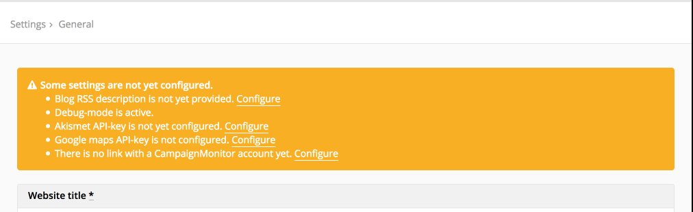

# Getting started

We assume that you've already successfully [installed](../01. installation/01. installation.md) the software and are ready to start configuring your website. You'll find the private website configuration system in http://yourdomain.com/private.

Once you've logged into your account you'll see the Fork CMS dashboard. The dashboard includes a section called Analysis, which informs you of site errors or incomplete configuration items. You'll find the same list on the settings page.

After reviewing all pages of this guide and completing all steps, the list should be empty.
