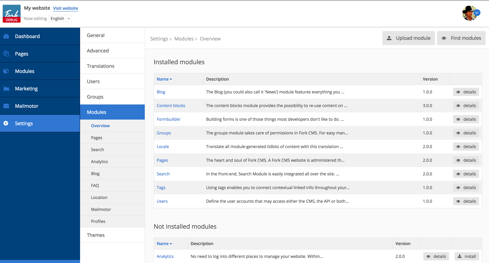
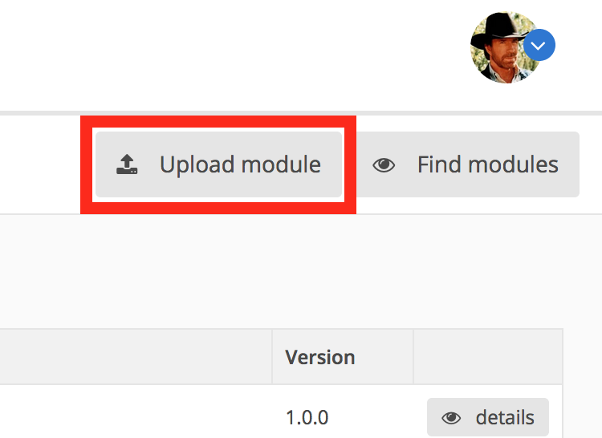

# Adding modules

Modules are parts of the CMS that extend the core functionality. An overview of modules for Fork CMS is available in the [extensions](http://www.fork-cms.com/extensions/apps) section. Some modules are already included with the original download. You can see the modules that are uploaded to your site by going to Settings > Modules.

The list at the top displays modules that are already installed, while the list at the bottom shows the modules that are available on your system but not installed yet. To upload a new module that you found on the [extension](http://www.fork-cms.com/extensions/apps) page, click the module and press *upload module* in the modules overview.

To install a module, just click on the *install* button next to the module.
