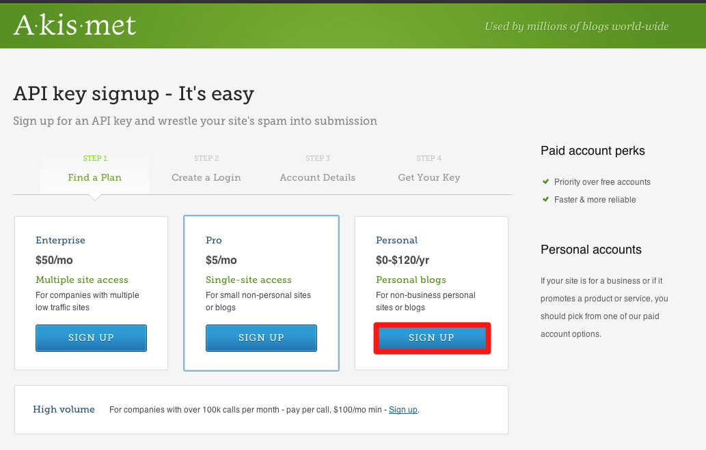
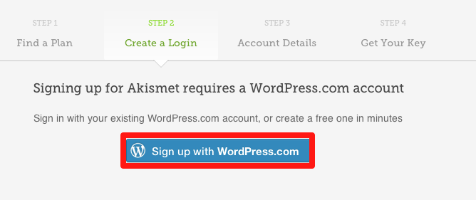
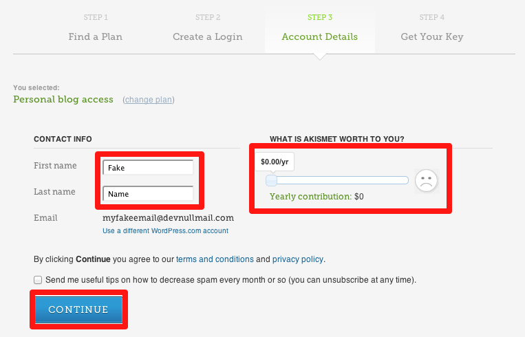
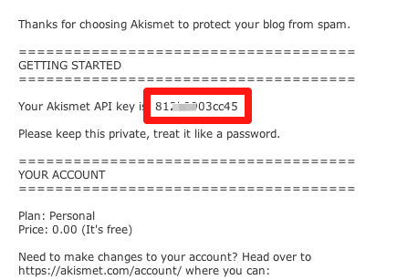
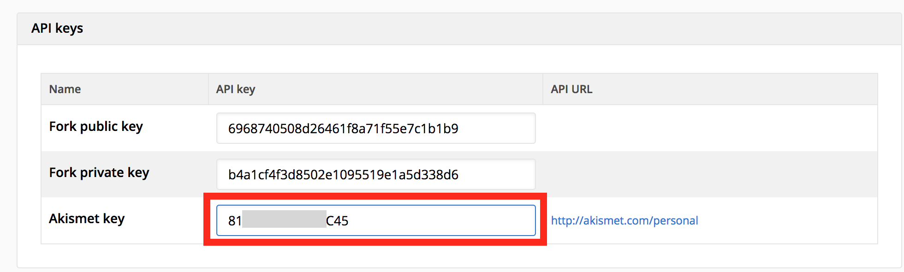

# Spam protection

When you've installed a blog or another module that allows comments, you also need to install an anti-spam service. Not only is spam irritating to visitors, but Google will [reward quality](http://googlewebmastercentral.blogspot.be/2012/04/another-step-to-reward-high-quality.html) content that doesn't contain spam.

The built-in spam protection of Fork CMS uses the very popular [Akismet](http://akismet.com/), which monitors millions of websites and analyzes the resulting data to provide your site with better protection. It is free for personal use and [affordable](https://akismet.com/signup/) for business use.

> Akismet is a hosted web service that saves you time by automatically detecting comment and trackback spam.

### Step 1: Get your Akismet key

The installation is simple. First, go to [http://akismet.com/signup](http://akismet.com/signup) and follow the signup steps.

Select your plan

Create a wordpress.com account. The email you use for this account will be used to send you the API key.

For the final step, fill in the account details and select the amount you want to pay for the service.

The Akismet API key will be sent by email. Treat your key as a password and keep it private.

### Step 2: Enter your key

In your Fork CMS dashboard, go to *Settings* and enter the API key on the *General* page.

If your site does receive spam, the majority will be intercepted by Akismet. You can also find information in the [user guide](../03. user guide/01. introduction.md) about manually assigning comments as spam.
