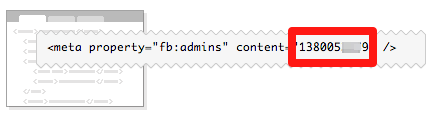
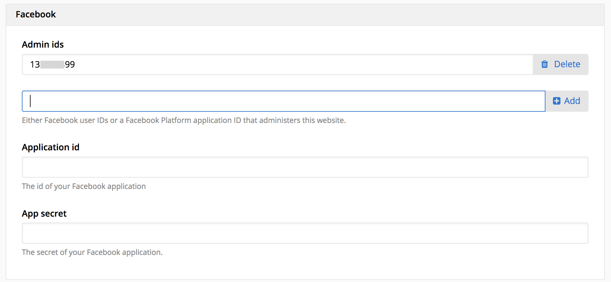

# Linking Facebook

When you want to start using [Facebook Insights](https://developers.facebook.com/docs/insights/) to measure the popularity of your website on Facebook, normally you have to add a verification key in your html. Fork CMS takes out that small technical part and let you just entering it from within the interface.

Copy your admin or application id out of the *content* part of the code.

And paste it to the admin ids, you'll find these at the bottom of the *General* *Settings* page. You can add as many admins as you want.

When the *Admin ids* field is filled in, Fork CMS will automatically add the necessary code to add a like button.

The *Application id* and *App secret* are used for custom functionality, visit the module specific documentation for more information.
