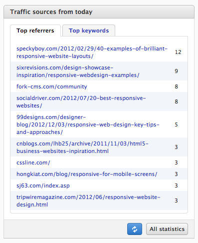

# Dashboard

The dashboard is the first view in Fork cms, the different widgets keeps you up-to-date about your website’s activity. Thereby it’s easy to respond to evolutions of your site.

## Traffic sources

### Websites

Here you’ll find a list of websites that placed a link to your website, the list is ordered by the amount of people that clicked on the link. Such links are very important for your ranking in search engines.

Click on the displayed links to visit the page.

###Keywords

Here you’ll find a list of a keywords that were used in a search engine to find your website. They are a good indication what people look for on your website.

## Blog comments

Displays in one view the latest comments on your blog. Click on the comment to moderate them.

## Mailmotor

* Subscriptions: An overview of the last subscribed email addresses with the exact time when the user registered.
* Unsubscriptions: An overview of the last unsubscribed email addresses with the exact time when the user unregistered.
* Statistics: Basic overview of the last sent newsletter.

## Personalize your dashboard

On the bottom of your dashboard you’ll find a link to personalize your dashboard. If you click on the link you can start dragging around the different widgets. Click on the cross to hide a box.

Take a look in our Module guide to see how you can write your own dashboard widgets.
