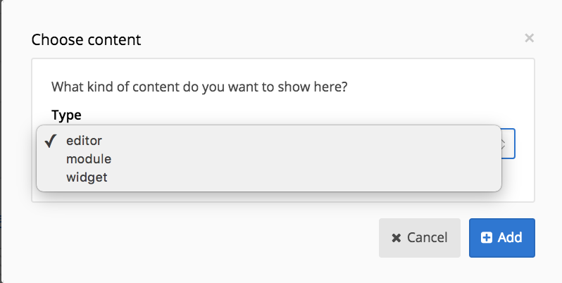

# Pages

Once you opened the pages tab, you’ll find on the left side of your screen an hierarchical overview of all your pages. They’re all structured under three default directories: Main navigation, footer navigation and single pages, The pages that are placed in single pages are not in your navigation structure and therefore only accessible with a direct link. Drag the pages to change the order, hierarchical order or the directory.

## Editing a page

### Content

Once you clicked a page which you want to edit, the first view you see is the content tab. This page gives a clear overview of the structure of your page, this structure is called the template. You can change the template by clicking on the *Change template* button on the top right. The available templates depends on the theme of your chose.

The template is made of different positions (E.g.: main, left, right, top, advertisement, etc). In our content view it easy to see where our positions are based. Each position consists of content blocks. We have three types of content blocks:

* Editor, the text editor for text, images, videos, etc.;
* Module, which allows you to connect a module to your page;
* Widget, is small dynamic content.

Each position can hold as many editors or widgets as you want. Although it is recommended to use the editor only for unique content for the page you place it on. If you want to use the same text on different pages, add it in the content blocks module. More about that in the modules section.

Every page can hold maximum one module, except the homepage which can’t hold any module. The reason for this is in the url, by connect a certain module to a page, you specify the url for the module’s content.

### Versions

Every time you press Save or Save draft new version is created of your page. In this tab you can rollback to an earlier version. This feature can be a lifesaver if something went wrong by editing the page.

The amount of versions that is saved can be edited in the settings.

### SEO

All SEO features are bundled into one section.

### Tags

Specify tags that can be linked to the content of your page. If your theme is proper configured it enables you to link the content with content in the modules. E.g.: link a blog post with a product page.

### Redirect

Sometimes you want a menu item to go to an external website or another internal page. In the redirect tab the targeted page can be configured.

### Authentication

This tab will only be shown when the profiles module is installed. Sometimes you would like to have only logged in users to view specific pages, or even specific groups. This is now possible within the authentication tab. When enabling user authentication this page will be hidden from the navigation and can not be visited by a non-authenticated user. When you have created groups within the profiles module and once you enabled user authentication you'll have the option to limit access depending on the profiles group.

### Settings

At the settings page you are able to change the basic properties of your page. The first options let you hide the page. The use this page as module-action can be check if you link a sub-action directly to a page. For instance if you want a custom template for the detail of a blog post.

## User templates

User templates are a way to allow someone to provide content that needs to be displayed in a certain way without the need for a custom module

Inside the theme you can define as many of these templates as you want.

The fields are taken dynamically from the template using data attributes

currently supported:

- link
- link-without-content
- text
- textarea
- editor
- image
- image-background

### Example configuration

`[path_to_theme]/Core/Layout/Templates/UserTemplates/Templates.json`

    [
      {
        "title": "test",
        "description": "just a simple test",
        "file": "test.html"
      },
      {
        "title": "quote",
        "description": "easy way to add a quote",
        "file": "quote.html"
      }
    ]
### Example template

`[path_to_theme]/Core/Layout/Templates/UserTemplates/test.html`

    <a data-ft-label="link" data-ft-type="link" href="#">This is the placeholder for the link</a>
    
    <h2 data-ft-label="Title voor dit blokje" data-ft-type="text">Dit is een titel</h2>
    
Dit is de beschrijving

    
Dit is de editor

    
    

    
