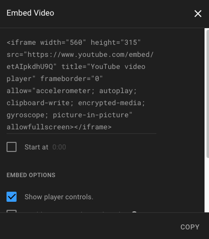
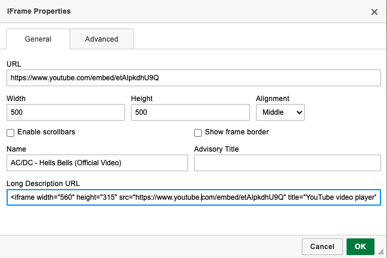

# The Editor

Most of the time when you’re editing text on your website it happens with the editor. The editor in Fork CMS is based on CKEditor, which allows you to see instantly how your text will look on the page.

The toolbar in the editor will look familiar to a lot of people because of the well known text editing functions.

* *Bold*, *Italic* and *Striketrough* speaks for themselves. If select text and click on one of these buttons the chosen style will appear.
* The *Undo* and *Redo* buttons are quick way to cancel changes that you recently did.
* The *list* buttons allow you to organise your items whether numbered or not.
* The *blockquote* button let you easily include quotes on a visual attractive way.
* The *link* buttons adds a given link to your text. First select the text where you want the link on and press the left link button. A pop-up will appear where you can provide the link. There three different link types.
The first one is a regular link with a url you provide. Place the url without http:// or https:// in the url textbox, select the right protocol and press ok.
In the same view you’re able to link to a page on your website without knowing the url. Just click the dropdown box and choose the internal page of your chose.
The second link type is anchor link, that means you forward the user to a certain part of your page. See the anchor functionality for more info.
The third link type is an email link, where you can provide email information which will be filled in automatically in the user’s email client. Although it is recommended to use forms!
* The *flag* button symbols anchors which allows you to mark certain points on your page. These points - or anchors - can be used to link to this specific part of your page. When you press the button and you gave a unique name to anchor point, a small yellow anchor will appear on the page. This icon will not be visible by the users, but it shows you to which points you link in the text. See the explanation about the link buttons about how you can link to an anchor point.
* The table button let you easily insert tables. The editor will choose the width and height of the cells by his own based on the filled in content. If you want to customize your table, row, column or cell properties, right click on the table and choose the wanted property window.

Note: Please only use tables to display an overview of structured data and not to reach your page layout goals.

* The *image* button allows you to add an image in your text. A few best practices comes with the functionality and responsibility of uploading your own images.
	* It is important that you’re sure that you are the owner or has the right license of the image.
	* If you place an image that’s hosted by your website, make sure you have the permission of the website owner too.
	* To ensure a good performance on your website we resizing your images on your computer and not by using the width and height functionality in the editor. This should only be used in rare cases.

Click on *Browse server* if you want to upload images to your website. Depending on the amount of images that will be used on the website, it can be practical to separate your images into different folders. Root folder are made by the server administrator and can not be changed, but if you right click on a folder you can add subfolders to organise your images. Double click an uploaded image to use it in your text.

* The *embed media* button allows you to embed external video’s, flash animations, etc. For example if you want to embed a youtube video, go to youtube video, click on share, in the extra menu that appears click on embed and copy the html code that is given into the textbox of the embed media pop-up.

* The *special character* allows you to easily add a that one strange character you couldn’t find on your keyboard. (Tip for mac users, keep a key pressed to show a pop-up with special characters)
* The *Content templates* button can be used to add layouts to your text. This templates can only be made by the maker of your theme.
* The fullscreen buttons makes your 30” screen more useful while editing your website’s text.
* The *html* button allows you to customize your text with your own html tags. Don’t know what html is? Don’t worry about this button, it’s a tool for nerds anyway. ;-)
* The *paragraph format* menu let you select the right paragraph formats, which allow you to keep the presentation of your text uniform. E.g.: If you select for all your subtitles heading 2, your designer will be able to easily change the color of all your subtitles.
* The *styles* menu let’s you add theme specific styles to your text.
