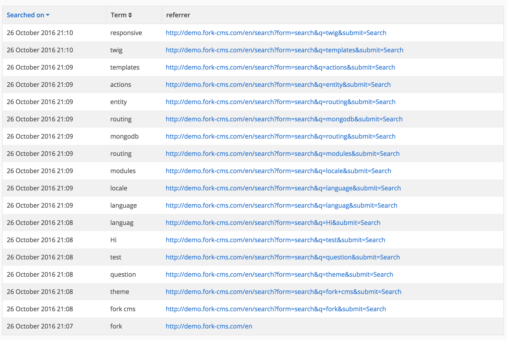
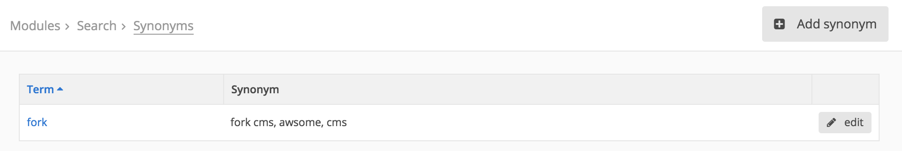
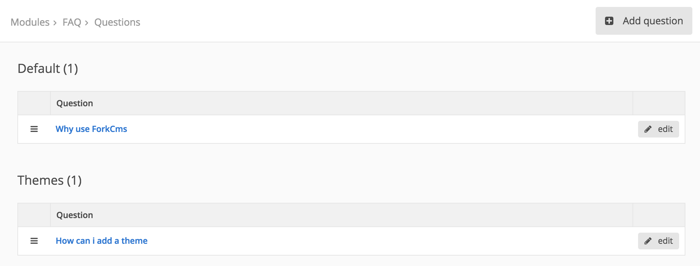
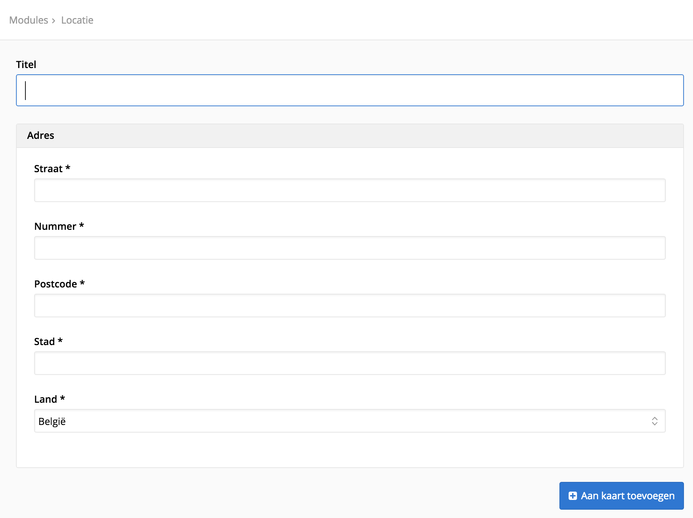

# Standard modules

## Search

View which search keywords are used on which page of your website. This should give you a good overview of what people expect from a certain page. Or what your visitors are looking for.

When you see a common mistake in the overview or when your visitors use the wrong terminology you can add synonyms to lead them to the correct page. Use add Synonym to specify the correct term and specify the synonyms used by the visitors. The search module will make sure the visitor sees the same result as by the original keyword.

## Content blocks

One content block can be displayed onto different pages which allows you to centralize your content and you don’t have to change your text on every page. The blocks are very useful for adding Call-To-Actions where users teased to go to certain pages.

While adding or editing a content block you can provide a title, this is only used for you to distinguish the different blocks, the title will not be displayed to users.

## Tags

Tags let you connect different content to each other. E.g.: Each blog post, page, product, etc. you add with a tag called “Chuck Norris” will be connected by this word.

It’s not possible to add tags in the module, it’s always done while adding content. But it is possible to correct or delete tags.

## Blog

Most of the modules work just like the blog module, the most of the explanation can be used for other modules too.

The blog module is split in three parts: articles, comments and categories. It speaks for itself that comments are part of the articles, as the articles themselves are part of the categories. So the first thing you want to do is change the title of the *default* category before you start writing your blog posts.

When entering an article fill in at least all the required fields marked with a star (*). Depending the length of your article, adding a summary can make your blog overview page more user friendly.

The maximum filesize for the image is set by the server configuration. The publish date is using the clock of your server too to decide when your post should be public. If you want to change these you’ll have to ask your server administrator.

Pro tip: The blog module has an hidden feature to import a blog from blogger.com, go to */blog/import_blogger* to use this.

## FAQ

With a full list of Frequently Asked Questions you can help your visitors in a fast way without they have to contact you. The order of the questions or categories can be changed by dragging the handle on the left.

## Formbuilder

Probably one of the hottest features in your favorite cms. Use forms to let visitors send you structured information in an easy way.

When adding a form you only provide the basic information, the fields are added later. It is not possible to just send the information by email, there is no reason why you wouldn’t save in a database, it’s for the best. The success message is the text your users get when they filled in your form successfully. You don’t have give an error message, this is dynamically created by the fields you’ll add.

Once you added the form you can start adding fields. Adding a field is as simple as clicking on the right field type and providing the right information. The order of the field can be changed by dragging the icon on the right next to the field. The modifications you make in the fields tab are immediately saved, you don’t have to click the save button for that.

## Location

Adding interactive maps can be a great addition for the usability of your website. Creating a map for every address let them easily look up the directions.

## Profiles

The biggest functionality of the profiles modules is on your website (frontend) and not in your cms (backend). It enables visitors to create their own profile. In the backend you can manage these profiles by adding new ones, editing their information, blocking users, etc.

This module is at his best when there is extra functionality build to make use of these profiles.
