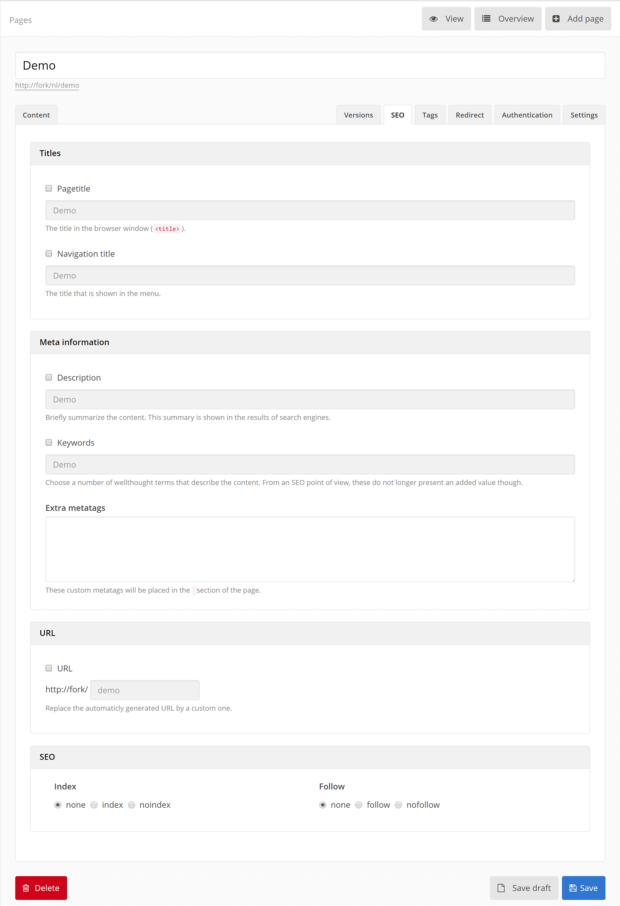

# SEO

While working with Fork CMS you’ll find on a regular basis the SEO or meta tab. These allow you to optimize your page for search engines. Changing this parameters doesn’t guarantee in a better result, therefore we only recommend to change these settings if you have a good reason.

## Titles

In this part you can change the title that is displayed on the top of your browser window. This title is used in the search result pages of the search engines too.

Or you can change the title in your menu.

## Meta information

In the description area you can give a short teaser about what the content on the page is about. The text is shown on the search results page of search engines. Make a text that gives users a reason to click on your website, limit the text to a maximum of 3 lines.

The keywords should be related to your content, in theory this should influence the keyword on which result pages you’ll be displayed on the search engines. Limit this to max. 5 keywords separated by a comma.

Normally you wont need extra meta tags on your page, in the rare cases that it happens you can filled them in here by using the whole html tag. E.g.: *<meta name="author" content="Chuck Norris" />*

## Url

By default the url of your page is automatically created, in most cases that will be the given title. Here you can change this url by a custom one. This can be useful when you want to change the title but not want to lose the links to your page.

## SEO

If you don’t want the page to be included in search results of a search engine, check *noindex*. And if you don’t want a [web crawler](http://en.wikipedia.org/wiki/Web_crawler) to follow the links on your page you can check *nofollow*.
