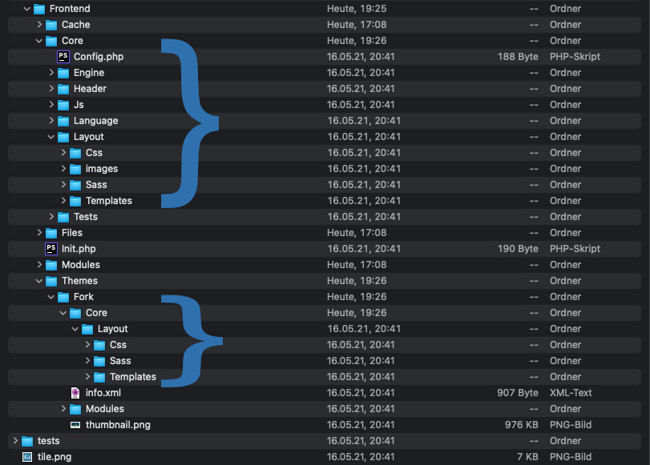

# What is a theme within Fork?

Themes allow you to override the core, so you can make changes to a website without putting the core at risk. Every module has default templates to start of with, though a theme can override each and everyone of these default templates. This, however, doesn't mean you have to overwrite the entire core. You only overwrite files that will make a difference. Fork CMS will detect all the files in the theme folder and mirror them with the core. If there are files in the theme folder that also exist in the core, those in your theme will always get the upperhand.

If you put the filestructure of the core and a theme side by side, you'll see that these resemble each other. This should give you a further insight in how themes work.

When you start building a website, you'll first want to set up a steady core. This means you have at least some own core-templates (head.html.twig, footer.html.twig, navigation.html.twig...) ready. Once you have your base set, you can alter it with themes.
