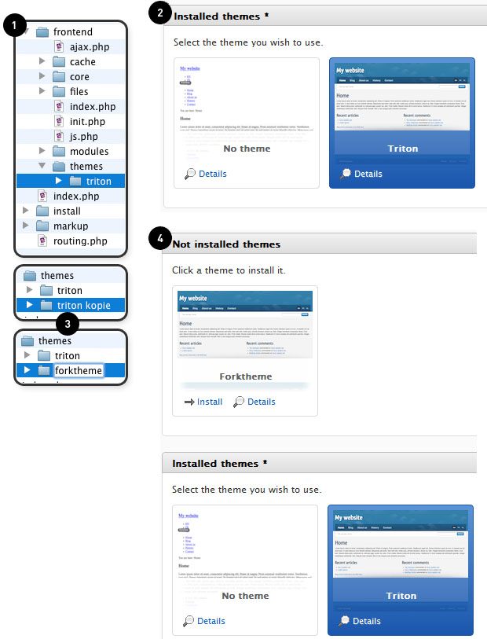

# Theme contents

Let's take a look at /frontend/themes **(1)**. In this folder you can find Triton, the default theme that comes pre-installed with Fork CMS. In the backend you can see all available themes by going to http://forktheme.local/private/en/extensions/themes **(2)**.

To make your own theme, you can copy the Triton folder and rename it to the name of your theme **(3)**. You should also change the name of the theme in the info.xml file. More info about editing this file can be found in Part 5: an example. If everything is done correctly you will be able to select your own theme in the backend **(4)**.

By copying the Triton folder, you now have the correct base structure and files to start building your own theme:

* apple-touch-icon.png → this icon will be used when the visitor of your site makes an alias of your site on his or her iPad or iPhone.
* core folder → this folder contains the theme related templates javascript, images, CSS, and fonts.
* core/templates → this is the place to save your page templates. These templates can be linked in the backend so you can select them for the pages of your website.
* module folder → this folder contains the widgets and templates of the modules available in your theme.

Let's take a close look at what's inside Triton.

## home.html.twig & default.html.twig

These are page templates. These templates are used by the CMS to define the different content pages.

## head.html.twig & footer.html.twig

These two templates are included in the above-mentioned page templates (home.html.twig & default.html.twig) via following code: {% include "core/layout/templates/head.html.twig" }} & {% include "core/layout/templates/footer.html.twig" }}.
Using this method, we avoid duplicate code in the page templates. So if you change footer.html.twig it changes in all templates where it is included (huge time saver for larger sites with a lot of page templates that contain recurring code like the `<head>` tag.)

## html5.js

This nifty script is a fallback for non-HTML5 browsers. This enables you to use HTML5 markup without breaking the site in archaic browsers.

## triton.js

Contains some default scripts, e.g. a class called '.linkedImage' is assigned to a link that contains an image. You can use this class to get rid of the border-bottom we use on ordinary text-links.

## screen.css

The main css-file used for styling your theme. It contains a decent reset system and the different Internet Explorer versions are detected by the conditional comments in head.html.twig. No extra css-files are needed, you can simply scope the IE-browser by using: .ie6, .ie7, .ie8 or .ie9 in the screen.css. (The motivation behind this method can be read at the website of [Paul Irish](http://paulirish.com/2008/conditional-stylesheets-vs-css-hacks-answer-neither).)
