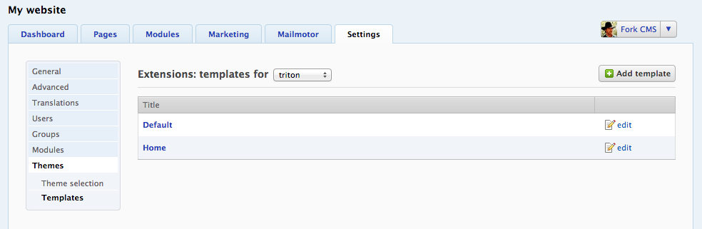

# Creating a template

Whether your using an existing theme or building your own, creating your own templates is an essential skill you have to learn when you want to change the layout of your website.

We assume you know what the [difference](docs/04. page_templates_positions_and_blocks.md) is between templates, positions and blocks. Also, html knowledge is required.


## Create file

All template files which come with a theme are located in `/src/Frontend/Themes/mycustomtheme/Core/Layout/Templates/`. A template file (.html.twig) consists of html and [twig tags](http://twig.sensiolabs.org/doc). It is recommended to use `include`, `extend` and `macro` tags to split your html between different files to make later adjustments easier. Take a look to the default [Triton](https://github.com/forkcms/forkcms/tree/master/frontend/themes/triton/core/layout/templates) theme as an example.

When you're editing not your own theme it may be easier to copy an existing template of the theme and start editing the copy.

## Add to Fork CMS

Once you created the file you gonna want it to add to your current Fork CMS setup. Go to the themes settings page, and select *templates* in left menu.



First make sure you selected the theme you want to add a template for, afterwards click on *Add template*.

Fill in the filename of the template, a name and the positions that you created with template modifiers. Adding default blocks is not required.

The layout reflects the structure of your template, it shows where to display the blocks. Use brackets `[` `]`, a comma for a column and a slash for non-editable areas.

Check *active* to show that your template is not a draft and to make sure you can use it.

You can only have one default, if you select it in your new template it will get disabled in the previous template.

## Info.xml

The *templates* part of the info.xml of your theme is only used during the installation. When your theme get installed on a new setup all the templates that are provided into this file will get created automatically.

Add them in the templates sections of the file.

For example the default template of the Triton:

```
<template label="Default" path="Core/Layout/Templates/Default.html.twig">
	<positions>
		<position name="main" />
		<position name="left" />
		<position name="top">
			<defaults>
				<widget module="search" action="form" />
			</defaults>
		</position>
		<position name="advertisement" />
	</positions>
	<format>[/,advertisement,advertisement,advertisement],[/,/,top,top],[/,/,/,/],[left,main,main,main]</format>
</template>
```

Once the template is correctly installed you can start using it in the pages section.
