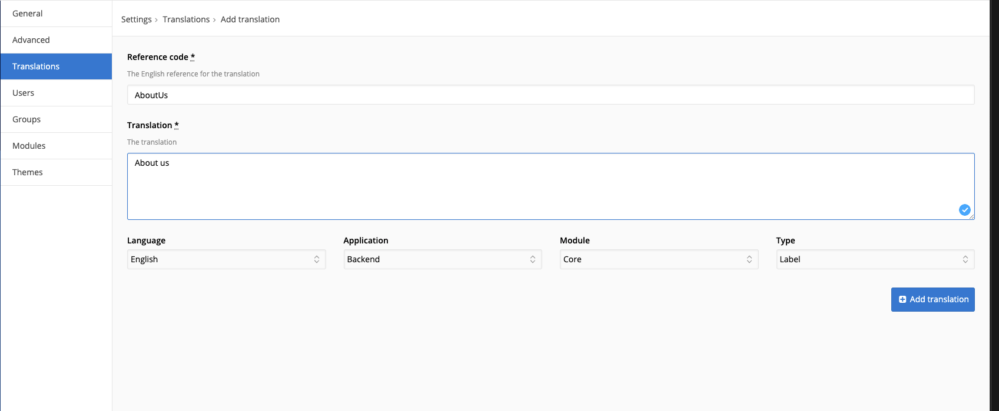

# Translations / Locale

Most websites you'll make will be available in different languages. Creating a separate website for each language is a waste of time, that's why Fork CMS has the Locale Module. As we saw in the previous chapter, we'll use placeholders in the templates to display the right text depending on what's the active language. This text has to be added in the database, which you'll do in the backend, under settings, translations.

> Just one language?
> Even if you're website has one language it still might be a good idea to use the Locale module:
>
> * You'll never know if a language needs to be added in the future.
> * You can give your customer access to the Locale Module. This way she/he can edit the labels him/herself. Otherwise, for every typo- you'll need to alter the text yourself in the code.

## Types

### Labels

Labels are used the provide a short literal translation. E.g.:
BlogCategories => blog categories

### Messages

Messages provide translations for longer texts. E.g.:
NoItems => there are no blog posts yet. You can add one by clicking the add button above.

### Actions

Actions are keywords that occur in the url (and as such are confined within a smaller set of characters: e.g. a questionmark is a no-go, since in url's it identifies the start of the querystring)

An example of an action would be:
Detail => detail

### Errors

When you want to display error messages, use this type of translation. E.g.:
FieldIsRequired => This is a required field.

> What's the difference?
> Apart from actions, there's no technical difference between the types. We just like to keep things tidy ;)

## Adding translations

As we said before, translations are added/edited in the backend. Here you see a screenshot of the input form:



The **reference code** is the name of the translation (Add, NoItems, ...). This code is always written in camelCasing with **an uppercase first letter**. This is because we'll be using a prefix depending on the type of translation when we're calling the translation in the templates.

* labels => `{{ 'lbl.NameOfTheTranslation'|trans }}`
* messages => `{{ 'msg.NameOfTheTranslation'|trans }}`
* actions => `{{ 'act.NameOfTheTranslation'|trans }}`
* errors => `{{ 'err.NameOfTheTranslation'|trans }}`

As you see, now it's “real” camelCasing.

The translation is the text that has to be displayed, depending on which language is used when viewing the website.

You'll have to select an Application too, Backend or Frontend. You select backend when you want to add a translation to the backend pages of your module. The translations of backend and frontend are saved in different files.

When you selected Frontend in the Application dropdown, you'll see you can only select core in the “module”-dropdown.

When adding translations for the backend however, you can select all the existing modules. This way, you can add different meanings for one Reference code:

| module    | reference code | translation       |
| --------- | -------------- | ----------------- |
| Blog      | NoItems        | no blog posts yet |
| MiniBlog  | NoItems        | no articles yet   |
| News      | NoItems        | no news yet       |
| Core      | NoItems        | no items yet      |

When editing a page, Fork CMS searches for a module specific translation, e.g. “no blog posts yet”. When the module specific translation was not supplied, Fork CMS searches for the “NoItems” translation for the “core” module, “no items yet” in our case.

Then, you just need to add the type of translation.

## Importing locale using the CLI

When developing modules, you sometimes want to import new translations.

You can do the following to import translations for a "Projects" module:
```bash
bin/console locale:import --module=Projects
```

If you want to override the current translations, you can do the following:
```bash
bin/console locale:import --module=Projects --overwrite
```

You can also choose to use a filename directly:
```bash
bin/console locale:import --file=src/Backend/Modules/Projects/Installer/data/locale.xml
```
