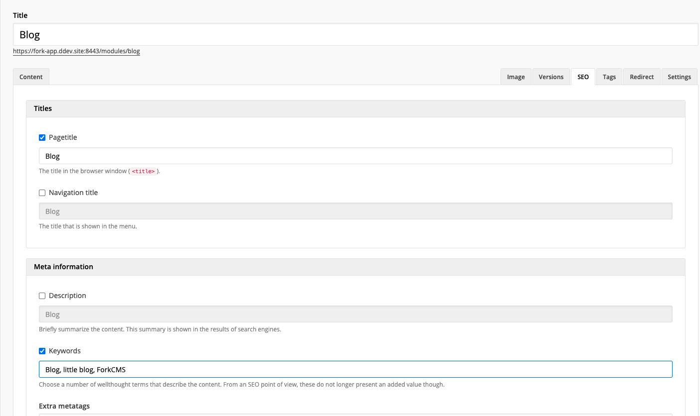

# Meta data & SEO

## What and why

Fork CMS tries to make it easy to optimize you website concerning SEO. It does this by paying special attention to generating readable url's, automatically adding the right info to the title-tag, providing a meta description and keywords, ...

## How to implement

For most pages, you don't have to do anything. Based upon the page title Fork CMS generates the necessary meta-data. However, you can overwrite this. Check the screenshot below.



However, especially for our blog this is not very interesting. This way every page in the blog will have the same page title, the same meta data, ... We want the meta data to be related to the article we've opened.

### The SEO tab

First, we'll need to add the SEO-tab to the edit and add pages of our backend. You can this by adding the lines below to the add and edit template.
The tab itself:

```
<li><a href="#tabSEO">{{ 'lbl.SEO'|trans|ucfirst }}</a></li>
```

The content of the tab.

```
<div id="tabSEO">
    
</div>
```

In add.php, in the `loadForm` function, you'll load all the form fields displayed on the tab by writing:

```
use Backend\Core\Engine\Meta as BackendMeta;

...

$this->meta = new BackendMeta($this->form, null, 'title', true);
```

For the edit.php file, we need the forms already be filled in with the previous saved data. You'll do this by supplying the correct meta_id. (see further on)

```
$this->meta = new BackendMeta($this->form, $this->record['meta_id'], 'title', true);
```

The third arguments supplies the field name that should be used to generate the readable url's.

To set the callback, we use the setUrlCallback method. The basic callback is the getUrl function in the module model class. The third parameter is used when we're in an edit action and we want to overwrite the meta instead of adding a number (e.g. blog-article-2 instead of blog-article).

```
use Backend\Modules\Blog\engine\Model as BackendBlogModel;

...

// set callback for generating an unique url
$this->meta->setUrlCallback('BackendBlogModel', 'getUrl', array($this->record['id']));
```

### Save the filled in data

Both in the edit and action program you'll have to save the submitted data. This happens in the same way you validate the other form fields.

In the validateForm method, Just beneath validating the other forms, write:

```
$this->meta->validate();
```

When everything is validated, save the meta-data.

```
$item['meta_id'] = $this->meta->save();
```

As you probably have guessed, our mini_blog needs to have an extra field "meta_id". Here we save the id of of the meta-record in the meta-table related to our article.

### Using the meta-data

The last thing we need to do is overwrite the meta-data supplied on the page itself with the meta-data of the record.

In our case, you'll add the following lines to the detail.php in the parse method.

```
$this->header->setPageTitle($this->record['title']);
$this->header->setMetaDescription($this->record['meta_description'], $this->record['meta_description_overwrite']);
$this->header->setMetaKeywords($this->record['meta_keywords'], $this->record['meta_keywords_overwrite']);
```

Of course we need to fetch this meta info first. This we'll do in the model.php, when fetching the item together with the meta-data with an inner join.

```
SELECT i.id, i.language, i.title, i.introduction, i.text, i.awesomeness,
		UNIX_TIMESTAMP(i.edited) AS edited, i.user_id,
		m.keywords AS meta_keywords, m.keywords_overwrite AS meta_keywords_overwrite,
		m.description AS meta_description,
		m.description_overwrite AS meta_description_overwrite,
		m.title AS meta_title, m.title_overwrite AS meta_title_overwrite,
		m.url
	FROM mini_blog AS i
		INNER JOIN meta AS m ON i.meta_id = m.id
		WHERE i.language = ? AND i.publish = ? AND m.url = ?
		LIMIT 1
```
