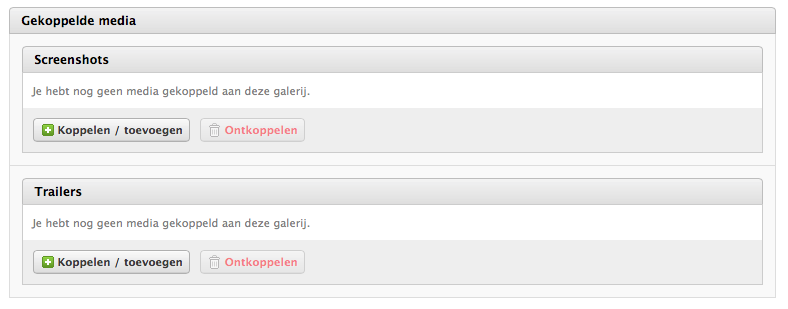

# How to integrate the Fork CMS MediaLibrary Module into a custom Fork CMS Module?

> The example below shows you how easy it is to add media groups to your custom module. We show you how to add an "images" and "trailers" MediaGroup.

Overview:
* [Integration in Backend](#integration-in-backend)
* [Integration in Frontend](#integration-in-frontend)
* [Database changes](#database-changes)

## In your custom Entity

```php
use Backend\Modules\MediaLibrary\Domain\MediaGroup\MediaGroup;
```

```php
/**
 * @var MediaGroup
 *
 * @ORM\OneToOne(
 *      targetEntity="Backend\Modules\MediaLibrary\Domain\MediaGroup\MediaGroup",
 *      cascade="persist",
 *      orphanRemoval=true
 * )
 * @ORM\JoinColumn(
 *      name="mediaGroupId",
 *      referencedColumnName="id",
 *      onDelete="cascade"
 * )
 */
private $mediaGroup;
```

```php
public function getMediaGroup(): MediaGroup
{
    return $this->mediaGroup;
}
```

You will also need to add set `$this->group = $mediaGroup` in your constructor (and `create`) and `update` method.


### In your Symfony FormType class

```php
use Backend\Modules\MediaLibrary\Domain\MediaGroup\MediaGroupType;
```

```php
$builder->add(
    'mediaGroup',
    MediaGroupType::class,
    [
        'label' => 'lbl.MediaConnected',
        'constraints' => [new Valid()],
    ]
)
```
> You can replace `lbl.MediaConnected` by your own backend label, f.e.: 'Screenshots', 'Trailers', 'Preview images', ...

```php
$builder->add(
    'mediaGroup',
    MediaGroupType::class,
    [
        'label' => 'lbl.Trailers',
        'constraints' => [new Valid()],
    ]
);
```

### In your Create Command class

```php
use Backend\Modules\MediaLibrary\Domain\MediaGroup\MediaGroup;
use Backend\Modules\MediaLibrary\Domain\MediaGroup\Type as MediaGroupType;
```

```php
/**
 * @var MediaGroup
 */
public $mediaGroup;
```

**In your __construct()**
```php
$this->mediaGroup = MediaGroup::create(\Backend\Modules\MediaLibrary\Domain\MediaGroup\Type::fromString('image'));
```
> Possible MediaGroupType values are; "all", "audio", "file", "image", "image-file", "image-movie", "movie". Which defines which MediaItem files are allowed in this MediaGroup.

### In your Create Command Handler class

Just pass the media group entity to your custom entity constructor.

### In your Add action

```php
$this->tpl->assign('mediaGroup', $form->getData()->mediaGroup);
```

Example: `/src/Backend/Modules/MediaGalleries/Actions/Add.php

### In your Update Command class

```php
use Backend\Modules\MediaLibrary\Domain\MediaGroup\MediaGroup;
```

```php
/**
 * @var MediaGroup
 */
public $mediaGroup;
```

**In your __construct()**
```php
$this->mediaGroup = $customEntity->getMediaGroup();
```
OR if you are integrating mediaGroup in an existing module, use the following:
```php
$this->mediaGroup = $customEntity->getMediaGroup();

if (!$this->mediaGroup instanceof MediaGroup) {
    // Note: I'm using 'image' in this example, use what you want, ...
    $this->mediaGroup = MediaGroup::create(MediaGroupType::fromString('image'));
}
```

### In your Edit action

```php
$this->tpl->assign('mediaGroup', $form->getData()->mediaGroup);
```

Example: `src/Backend/Modules/MediaGalleries/Actions/Edit.php`

### In your Add and Edit template

This will result in:


```twig
{# Only include the BackendMediaGroupsHelper once #}


{{ form_widget(form.mediaGroup, {'mediaGroup': mediaGroup}) }}
```

Example: `src/Backend/Modules/MediaGalleries/Layout/Templates/Add.html.twig` and `src/Backend/Modules/MediaGalleries/Layout/Templates/Edit.html.twig`

## Integration in Frontend

### First possibility: integrate in the PHP action class.

Example: `src/Frontend/Modules/MediaGalleries/Widgets/Gallery.php`

> Example: Blog detail

```php
class Detail
{
    public function loadData()
    {
        $this->blogArticle = new BlogArticle();
    }

    public function parse()
    {
        $this->tpl->assign(
            'imagesWidget',
            // We can create widget for the MediaGroup id
            $this->get('media_library.helper.frontend')->parseWidget(
                'Listing',
                $this->blogArticle->getImageMediaGroup()->getId(),
                'MyCustomOptionalTitle'
            )
        );

        $this->tpl->assign(
            'trailersWidget',
            // We can create widget for the MediaGroup id
            $this->get('media_library.helper.frontend')->parseWidget(
                'Slider',
                $this->blogArticle->getImageMediaGroup()->getId(),
                'MyCustomOptionalTitle'
            )
        );
    }
}
```
> You can optionally give in a fourth parameter $module (default $module = "Media"), so you can create a Media widget in your own Custom module.


### Second possibility: use the available TwigFunction media_library_widget.

{# Slider widget #}
{{ media_library_widget('Slider', blogArticle.mediaGroup.id) }}

Possible values in the core are: 'Slider', 'Lightbox', 'Listing', 'OneImage', 'OneRandomImage'. But you can easily create your own by just duplicating one of these files.

## Database changes

> We have chosen to have a tight-coupled connection between your "custom entity" and the "MediaGroup", which holds all the connected media items.

### When using Doctrine entities

> Since Fork CMS 4, more and more modules are going to use Doctrine for saving their objects (= called Entities) to their database.
> Because of the tight-coupled connection, you can easily get all images like this: $blogArticle->getImagesMediaGroup()->getConnectedItems().

```php
//...
use ForkCMS\Bundle\MediaBundle\Entity\MediaGroup;

/**
 * BlogArticle entity example
 */
class BlogArticle
{
    /**
     * @var MediaGroup
     *
     * @ORM\OneToOne(
     *      targetEntity="Backend\Modules\MediaLibrary\Domain\MediaGroup\MediaGroup",
     *      cascade="persist",
     *      orphanRemoval=true
     * )
     * @ORM\JoinColumn(
     *      name="imagesMediaGroupId",
     *      referencedColumnName="id",
     *      onDelete="cascade"
     * )
     */
    protected $imagesMediaGroup;

    /**
     * @var MediaGroup
     *
     * @ORM\OneToOne(
     *      targetEntity="Backend\Modules\MediaLibrary\Domain\MediaGroup\MediaGroup",
     *      cascade="persist",
     *      orphanRemoval=true
     * )
     * @ORM\JoinColumn(
     *      name="trailersMediaGroupId",
     *      referencedColumnName="id",
     *      onDelete="cascade"
     * )
     */
    protected $trailersMediaGroup;

    /**
     * Construct
     *
     * @param MediaGroup $imagesMediaGroup
     * @param MediaGroup $trailersMediaGroup
     */
    public function __construct(
        // ...
        MediaGroup $imagesMediaGroup,
        MediaGroup $trailersMediaGroup
    ) {
        $this->imagesMediaGroup = $imagesMediaGroup;
        $this->trailersMediaGroup = $trailersMediaGroup;
    }

    /**
     * Get images MediaGroup
     *
     * @return MediaGroup
     */
    public function getImagesMediaGroup()
    {
        return $this->imagesMediaGroup;
    }

    /**
     * Get trailers MediaGroup
     *
     * @return MediaGroup
     */
    public function getTrailersMediaGroup()
    {
        return $this->trailersMediaGroup;
    }
}
```
