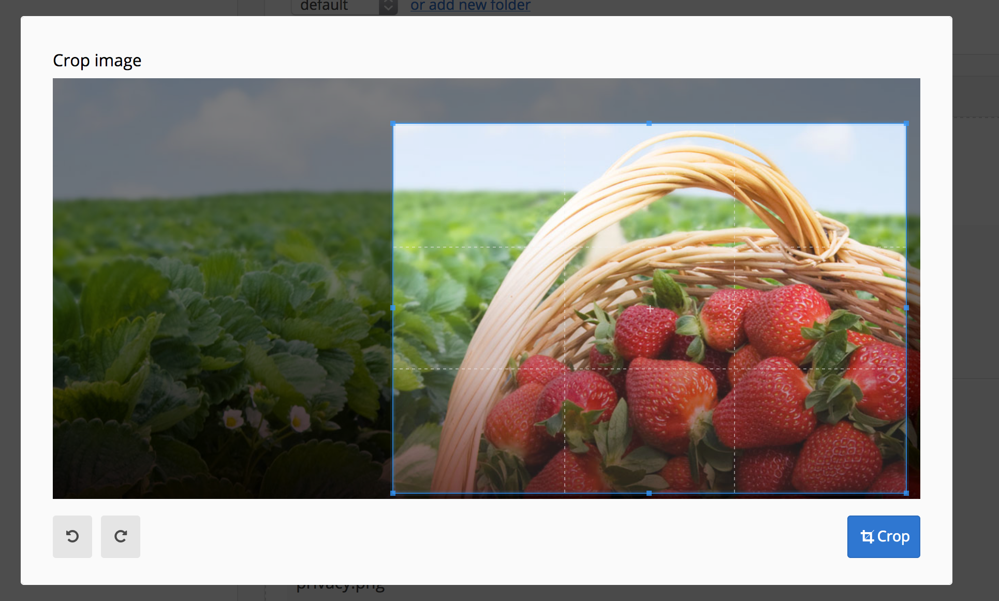

# Cropper

When you upload an image with the media library you get the option to crop or rotate the image. But in some cases you might want that crop to have a specific aspect ratio.



To set a fixed aspect ratio you need to use the option `aspect_ratio` of the MediaGroupType (`Backend\Modules\MediaLibrary\Domain\MediaGroup\MediaGroupType`). This option accepts an AspectRatio (`Backend\Modules\MediaLibrary\Domain\MediaItem\AspectRatio`).

The height and width of the final image will depend match the height and width of the cropped area of the original image to prevent stretching or compressing.

```php
class MyFormType extends AbstractType
{
    public function buildForm(FormBuilderInterface $builder, array $options): void
    {
        $builder
            ->add(
                'mediaGroup',
                \Backend\Modules\MediaLibrary\Domain\MediaGroup\MediaGroupType::class,
                [
                    'label' => 'lbl.MediaConnected',
                    'constraints' => [new \Symfony\Component\Validator\Constraints\Valid()],
                    'required' => false,
                    'aspect_ratio' => \Backend\Modules\MediaLibrary\Domain\MediaItem\AspectRatio::fromWidthAndHeight(16, 9)
                ]
            );
    }
}
```
